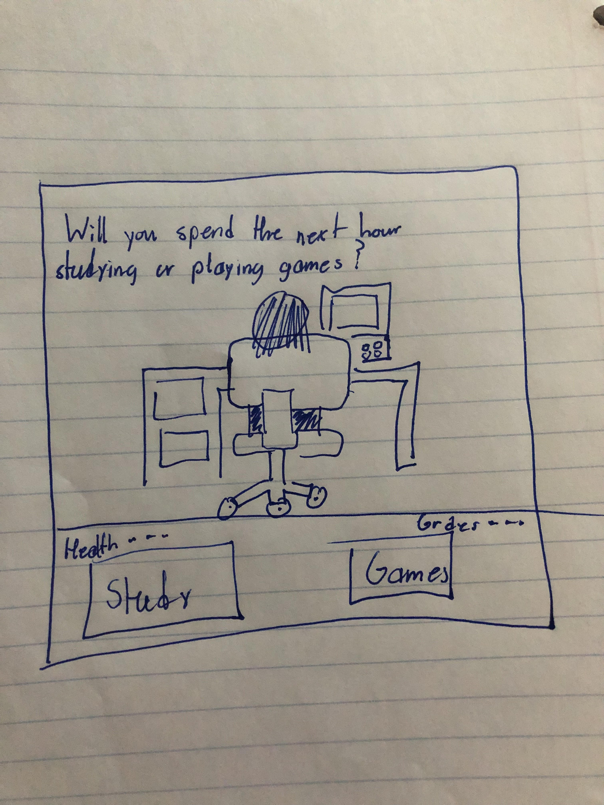

:warning: Everything between << >> needs to be replaced (remove << >> after replacing)

# Bearcat Jump
## CS110 Final Project  Fall, 2023

## Team Members

Allison Jenkins, David Fayle

***

## Project Description

We adjusted our project, modeling it after the classic "Doodle Jump" game. Long long ago, back in the 2010s, we both distinctly remember tapping and moving the Doodle figure around the screen of our parent's phone, hoping to beat our previous high score. We decided to recreate this nostalgia and make it our own. Enjoy "Bearcat Jump"!!!

***    

## GUI Design

### Initial Design

### Final Design

## Program Design

### Features

1. Menu Options
2. Random Platforms
3. Doodle Jumping
4. Doodle moving left and Right
5. Doodle Flips Direction

### Classes

The Doodle Class - Doodle.py: In this class, we are able to create a "bearcat" that acts as our doodle in the game. We also created the methods for gravity, jumping, and and update method including our collision code.

The Button Class - Button.py: In the Button class, we created a method to actually draw the button, and then also a method that allows the user to click said button.

The Springs Class - Springs.py: Hopefully, we will be able to code more in the Springs class in the coming days.

The Platforms Class = Platforms.py: In this class, we created a method to create the platforms, and also wrote code to make the platforms appear randomly in the window.

The Baseplatform Class = Baseplatform.py: Perhaps our most simple class, we initialized the class to create a "grounding" for our Bearcat.

## ATP

| Step | Action | Result|

|1  | Run the main.py code. | This should trigger the game window to appear. |

|2  | Click the "Quit" Button | This will cause the game window to close. |

|3  | Click the "Start Game" Button. | This will cause the game to commence. |

|4  | Using the keyboard press "A" or "D". | This will move the Bearcat to the left or right, respectively. |

|5  | Press Spacebar. | This will move the Bearcat up smoothly. |

|6  | Land on a platform utilizing steps 4 and 5 | This will cause the Bearcat to "land" on a platform. |

